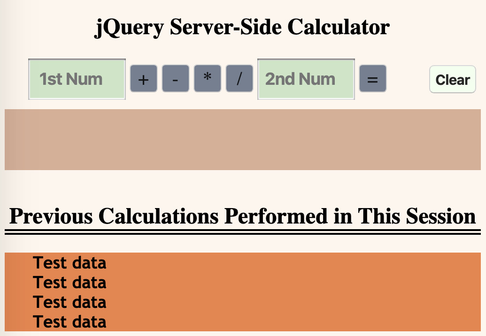

# jQuery Server-Side Calculator

## Description

NOTE: this remains a work in progress

This simple calculators accepts two user generated numbers and an operator. These parameters are sent via POST to the server where the calculation occurs. Once completed, the result and an updated history of all calculations performed during the session are displayed to the user. A "Clear" button is available to the user to refresh the input fields for new entries.

More to come...

Last updated 2020-03-29

## Screen Shot

 

## Built With
HTML/CSS
NODE
jQuery
JavaScript
Express
Postico
Body-Parser
And supporting tools: Visual Studio Code, GitHub

## License
[MIT](https://choosealicense.com/licenses/mit/)

## Acknowledgement
Thanks to the AMAZING team at [Prime Digital Academy](www.primeacademy.io) Kansas City as they teach and guide me through this project and the  process of becoming a full stack engineer. Extra props for their phenomenal effort and support to maintain this program, with excellence, during the 2020 Coronavirus Pandemic.

## Support
If you have suggestions or issues, please email me at [learn2code@respectdesfonds.com]

